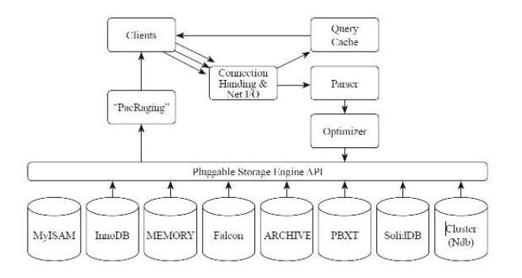

# 一、理解MySQL

## 1.查询执行过程概述

客户端（Clients）发布查询的流程如下，首先连接MySQL（ConnectionHandling），然后发布查询，如果缓存（QueryCache）中有结果集，则直接返回结果集。如果结果没有被缓存，那么，MySQL解析查询（Parser）将通过优化器（Optimizer）生成执行计划，然后运行执行计划通过API（Pluggable Storage Engine API）从存储引擎获取数据，并返回给客户端。

什么是执行计划（查询计划）呢？执行计划就是一系列的操作步骤。SQL是声明性语言，它只告诉数据库要查询什么，但并不告诉数据库如何去查。数据库所要做的就是基于算法和统计信息计算出一条最佳的访问路径。这个工作是由优化器来完成的。优化器会比较不同的执行计划，然后选择其中最优的一套。



## 2. MySQL权限

### 2.1 MySQL权限机制

MySQL权限控制包含如下两个阶段。

- 阶段1：服务器检查是否允许你连接。

- 阶段2：假定你能连接，服务器将检查你发出的每一个请求，查看你是否有足够的权限实施它。例如，如果你从数据库表中选择（SELECT）行或从数据库中删除表，那么服务器要确定你是否对表有SELECT权限或对数据库有DROP权限。


### 2.2 赋予权限和回收权限

一般在生产环境下，程序账号有增加、删除、查询、修改这4项功能即可。

```sql
# 赋予查询、插入、修改、删除权限，并进行密码设置
grant select,insert,update,delete on db_name.* to user_name@ '10.%' identified by 'password';
```

```sql
# 回收上面所赋予的权限
revoke select,insert,update,delete on db_name.* from user_name@ '10.%';
```


## 3.  长连接、短连接、连接池

一般情况下数据库服务器和客户端位于不同的主机的，这个时候就需要建立网络连接来进行通信。这里的建立网络连接的方式包括长连接和短连接。

### 3.1 短连接

短连接是指程序和数据库通信时需要建立连接，执行操作后，连接关闭。短连接简单来说就是每一次操作数据库，都要打开和关闭数据库连接，基本步骤是：连接→数据传输→关闭连接。

在系统中，连接会受到系统端口数的限制，连接断开后，端口不会被马上回收利用，必须经历一个“FIN”阶段的等待，直到可被回收利用为止，这样就可能会导致端口资源不够用：

* 在Linux上，可以通过调整/proc/sys/net/ipv4/ip_local_port_range来扩大端口的使用范围；调整`/proc/sys/net/ipv4/tcp_fin_timeout`来减少回收延期（如果想在应用服务器上调整这个参数，一定要慎重！）。
* 主机使用多个IP地址。端口数的限制其实是基于同一个IP:PORT的，如果主机增加了IP，MySQL就可以监听多个IP地址，客户端也可以选择连接某个IP:PORT，这样就增加了端口资源


### 3.2 长连接

长连接是指程序之间的连接在建立之后，就一直打开，被后续程序重用。使用长连接的初衷是减少连接的开销。

从客户端的角度来说，使用长连接有一个好处，可以不用每次创建新连接，若客户端对MySQL服务器的连接请求很频繁，永久连接将更加高效。对于高并发业务，如果可能会碰到连接的冲击，推荐使用长连接或连接池。

从服务器的角度来看，它可以节省创建连接的开销，但维持连接也是需要内存的。如果滥用长连接的话，可能会使用过多的MySQL服务器连接。现代的操作系统可以拥有几千个MySQL连接，但很有可能绝大部分都是睡眠（sleep）状态的，这样的工作方式不够高效，而且连接占据内存，也会导致内存的浪费。


### 3.3 连接池

由于一些数据库创建和销毁连接的开销很大，或者相对于所执行的具体数据操作，连接所耗的资源过多，此时就可能需要添加连接池来改进性能。

数据库连接池是一些网络代理服务或应用服务器实现的特性，如J2EE服务器，它实现了一个持久连接的“池”，允许其他程序、客户端来连接，这个连接池将被所有连接的客户端共享使用，连接池可以加速连接，也可以减少数据库连接，降低数据库服务器的负载。


### 3.4 持久连接和连接池的区别

长连接是一些驱动、驱动框架、ORM工具的特性，由驱动来保持连接句柄的打开，以便后续的数据库操作可以重用连接，从而减少数据库的连接开销。而连接池是应用服务器的组件，它可以通过参数来配置连接数、连接检测、连接的生命周期等。

如果连接池或长连接使用的连接数很多，有可能会超过数据库实例的限制，那么就需要留意连接相关的设置了，比如连接池的最小、最大连接数设置，以及php-fpm的进程个数等，否则程序将不能申请新的连接。


## 4. 存储引擎简介

运行如下命令可查看表的引擎。

```sql
 show table status like 'sys_accont' \G
*************************** 1. row ***************************
Name: sys_accont
Engine: InnoDB
```

其中，Engine栏位表示使用的是何种引擎。

MySQL不同于其他数据库，它的存储引擎是“可插拔”的，意思就是MySQL Server的核心基础代码和存储引擎是分离的，你可以使用最适合应用的引擎，也就是说MySQL支持不同的表使用不同的引擎。


### 4.1 InnoDB引擎

在MySQL 5.5及以后的版本中，InnoDB是MySQL的默认引擎，这些年来，InnoDB一直在持续改进，处理能力不断提高，其优秀的性能和可维护性使它成为生产中普遍推荐使用的引擎。它的优点有：

- 灾难恢复性好。
- 支持全部4种级别的事务。默认的事务隔离级别是可重复读（Repeatable Read），它的事务支持是通过多版本并发控制（MVCC）来提供的。
- 使用行级锁。
- 对于InnoDB引擎中的表，其数据的物理组织形式是簇表（Cluster Table），数据按主键来组织，也就是说主键索引和数据是在一起的，数据按主键的顺序物理分布。数据表的另一种常见形式是非簇表，其索引是有序的，而数据是无序的。
- 实现了缓冲管理，不仅能缓冲索引也能缓冲数据，并且会自动创建散列索引以加快数据的获取。相比之下，MyISAM只是缓存了索引。
- 支持外键。
- 支持热备份。


### 4.2 MyISAM引擎

MyISAM是MySQL5.0/5.1的默认引擎，它有许多缺陷，如不支持事务、灾难恢复性差，所以不建议在生产环境中使用。

以下是MyISAM的一些特性。

- 可以配合锁，实现操作系统下的复制备份、迁移。
- 使用表级锁，并发性差。
- 支持全文检索（MySQL InonoDB在5.6以后也支持全文检索）。
- 主机宕机后，MyISAM表易损坏，灾难恢复性不佳。
- 无事务支持。
- 只缓存索引，数据的缓存是利用操作系统缓冲区来实现的。可能引发过多的系统调用且效率不佳。
- 数据紧凑存储，因此可获得更小的索引和更快的全表扫描性能。


### 4.3 MEMORY存储引擎

MEMORY存储引擎提供“内存”表，也不支持事务、外键。

使用内存表（内存引擎）可以显著提高访问数据的速度，可用于缓存会频繁访问的、可以重构的数据、计算结果、统计值、中间结果，但也有如下这些不足之处。

- 使用的是表级锁，虽然内存访问快，但如果频繁地读写，表级锁可能会成为瓶颈所在。
- 只支持固定大小的行。VARCHAR类型的字段会存储为固定长度的CHAR类型，浪费空间。
- 不支持TEXT、BLOB字段。当有些查询需要使用到临时表（使用的也是MEMORY存储引擎）时如果表中有TEXT、BLOB字段，那么会转化为基于磁盘的MyISAM表，严重降低性能。
- 由于内存资源成本昂贵，一般不建议设置过大的内存表，如果内存表满了，就会在MySQL错误日志里发现类似“The table‘table_name’is full”这样的错误，可通过清除数据或调整内存表参数来避免报错。
- 服务器重启后数据会丢失，复制维护时需要小心


### 4.4 ARCHIVE存储引擎

ARCHIVE存储引擎是被设计用来存储企业中的大量流水数据的存储引擎。ARCHIVE引擎使用zlib无损数据压缩，让数据都保存在压缩的存档表中。当数据被插入时，它们被压缩。

它只支持INSERT和SELECT，支持自增键及其上的索引，不支持其他索引。它适合做日志记录、用户行为分析，不需要UPDATE、DELETE和索引的数据。


### 4.5 选择合适的引擎

是否支持事务、锁级别、是否支持热备份。其中，5.0版本、5.1版本默认的引擎是MyISAM，5.5版本、5.6版本默认的引擎是InnoDB。

| 存储引擎  | 事务支持 | 锁级别 | 热备份 | MySQL Server 版本 |
| --------- | -------- | ------ | ------ | ----------------- |
| InnoDB    | YES      | Row    | YES    | 5.1, 5.5, 5.6     |
| MyISAM    | NO       | Table  | NO     | 5.1, 5.5, 5.6     |
| Memory    | NO       | Table  | NO     | 5.1, 5.5, 5.6     |
| Maria     | YES      | Row    | NO     | 5.1, 5.5, 5.6     |
| Falcon    | YES      | Row    | YES    | 5.6               |
| PBXT      | YES      | Row    | YES    | 5.1, 5.5, 5.6     |
| Federated | NO       |        |        | 5.1, 5.5, 5.6     |
| NDB       | YES      | Row    | YES    | MySQL Cluster     |
| Archive   | NO       | Row    | NO     | 5.1, 5.5, 5.6     |
| CSV       | NO       | Table  | NO     | 5.1, 5.5, 5.6     |


以下是选择引擎时需要考虑的一些因素。

- 是否需要事务支持。
- 是否为高并发，InnoDB实现了行锁，这方面的表现大大优于MyISAM。
- 索引，不同存储引擎的索引实现不尽相同。
- 是否需要外键。
- 高效缓冲数据，InnoDB缓冲数据而MyISAM只缓冲了索引。
- 备份，是否需要支持热备份。

从维护的角度来说，维护统一的存储引擎会更方便，所以或者全部是MyISAM，或者全部是InnoDB引擎在现实生产中更常见，也更易于管理。


### 4.6 MySQL复制架构

下面简要叙述下MySQL的各种复制模式，为了方便理解，假设有A、B、C三个MySQL实例，它们的复制模式有如下几种。

- 主从模式 A→B
- 主主模式 A←→B
- 链式复制模式 A→B→C
- 环形复制模式 A→B→C→A

以上4种模式为复制的主要模式，生产中一般建议部署为主从模式，这也是最稳健的一种方式。

为了方便切换，在一定程度上提高可用性，也可以选择主主模式。需要注意的是，主主模式必须确保任何时刻都只有一个数据库是主动（Active）状态，也就是说同一个时刻只能写入一个主（Master）节点，否则可能导致数据异常。

链式或环形复制在生产中很少用到，它们的主要缺点在于，随着节点的增加，整个复制系统的稳健性会下降。

各种复制模式的基础都是主从模式，可以说，掌握了主从模式也就掌握了其他各种模式。


# 二、MySQL安装部署和入门

## 1. 如何选择MySQL版本

已经在生产环境中部署了MySQL，那么我们不需要急着将其升级到最新版本，旧的版本已经在生产环境中长期稳定地运行，而新版本刚出来时，往往并不是那么稳定，通常都会有一些Bug需要修复。不稳定版本将导致生产系统的不稳定，所以，如果不是急需新版本的某种特性，或者旧版本有严重的安全隐患，建议继续使用旧的MySQL版本即可。如果新版本已经稳定成熟且生产环境中的版本过于陈旧，那么可以考虑升级旧的MySQL版本。

升级到新版本，往往可以获得一定程度上的性能提升，先统一升级从库，再升级主库。由于升级主库可能对服务的可用性造成影响，因此需要和相关方协调好时间计划。如果前端有带数据库自动切换功能的中间件，或者应用层能够比较友好地处理主从切换，那么把数据库流量临时切换到从库，可以大大减少对生产服务的影响。


## 2. 官方版本的安装

安装方式分为：

* 二进制包的安装
* 源码编译安装

推荐大家使用二进制版本的安装，主要原因是简单方便，而且官方的二进制包也是经过了充分的测试验证和参数优化的。


具体安装步骤：

略。


## 3. MySQL的主要参数设置

1. innodb_buffer_pool_size

   为了提升写性能，可以把要写的数据先在缓冲区（buffer）里合并，然后再发送给下一级存储。这样做可提高I/O操作的效率。InnoDBBuffer Pool就是InnoDB用来缓存它的数据和索引的内存缓冲区，可由innodb_buffer_pool_size设置其大小。理论上，将这个值设置得越高，访问数据需要的磁盘I/O就越少。常见的做法是让这个值大于热点数据，这样可以获得比较好的性能。如果不清楚环境的数据量和访问模式，建议将其设置为机器物理内存大小的70%~80%。

2. innodb_log_file_size

   日志组里每个日志文件的大小。在32位计算机上日志文件的合并大小必须小于4GB，默认大小是5MB，在生产环境下，这个值太小了。官方文档推荐的值为从1MB到1/N的缓冲池大小，其中N是日志组里日志文件的数目（由innodb_log_files_in_group变量来确定，一般默认为2）。值越大，在缓冲池中需要检查点刷新的行为就越少，因此也越节约磁盘I/O，但更大的日志文件也意味着在崩溃时恢复得更慢。建议将日志文件的大小设置为256MB或更大，这样可以满足一般情况下的需要。

3. innodb_flush_log_at_trx_commit，建议设置为2

   这个选项的默认值是1。当设置为2时，在每个事务提交时，日志缓冲被写到文件中，但不对日志文件做刷新到磁盘的操作。对日志文件的刷新每秒才发生一次。所以，理论上，操作系统崩溃或掉电只会丢失最后一秒的事务。

4. sync_binlog，建议设置为0

   如果是autocommit模式，那么每执行一个语句就会向二进制日志写入一次，否则每个事务写入一次。如果sync_binlog的值为正，那么每当sync_binlog参数设定的语句或事务数被写入二进制日志后，MySQL服务器就会将它的二进制日志同步到硬盘上。默认值是0，不与硬盘同步。值为1是最安全的选择，因为崩溃时，你最多丢掉二进制日志中的一个语句或事务。但是，这也是最慢的选择，成本昂贵。

​	
